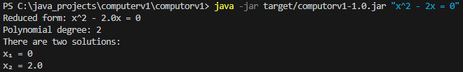
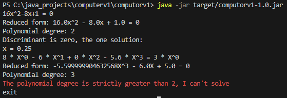
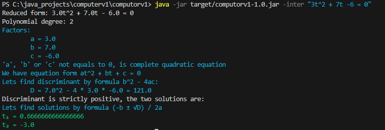
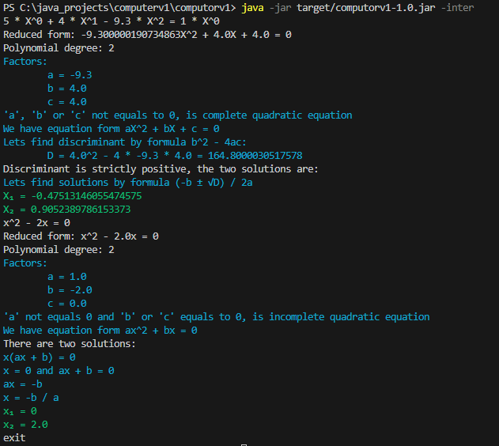

# Computorv1

Программа для решения полиномиальных уравнений до 2 степени.

## Сборка и запуск

Чтобы собрать программу запустите

    mvn install

Чтобы запустить программу

    java -jar target/computorv1-1.0.jar "<уравнение>"

Чтобы запустить в режиме последовательного ввода

    java -jar target/computorv1-1.0.jar

Далее введите уравнение (напоминание уравнение может быть со степенями больше 2, но должно сокращаться до уравнения 2 степени и ниже)

Чтобы выйти из программы введите `exit`

## Флаги

Флаг `-inter` показывает промежуточные стадии решения такие как поределение типа уравнения, дискриминант и дургие.

    java -jar target/computorv1-1.0.jar -inter "<уравнение>"
    java -jar target/computorv1-1.0.jar -inter

> [!NOTE]
> Флаг должен идти после имени программы, но перед уравнением

